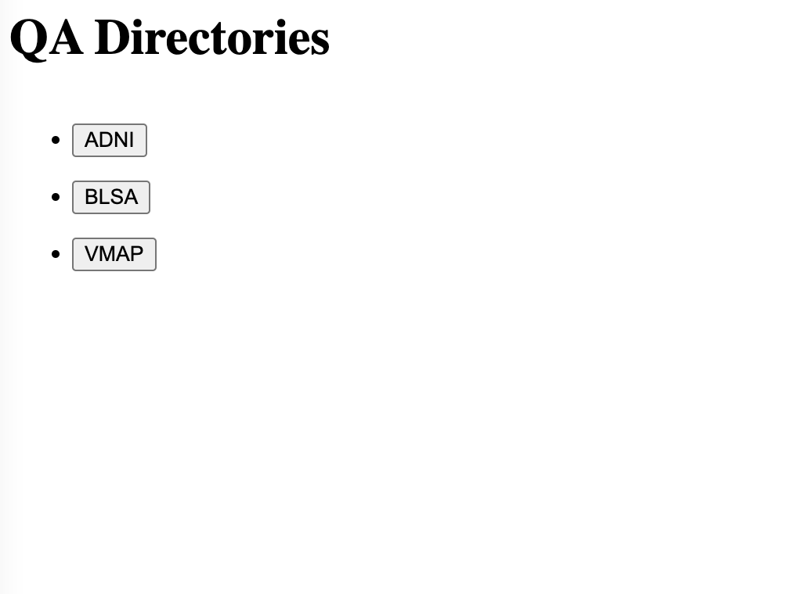
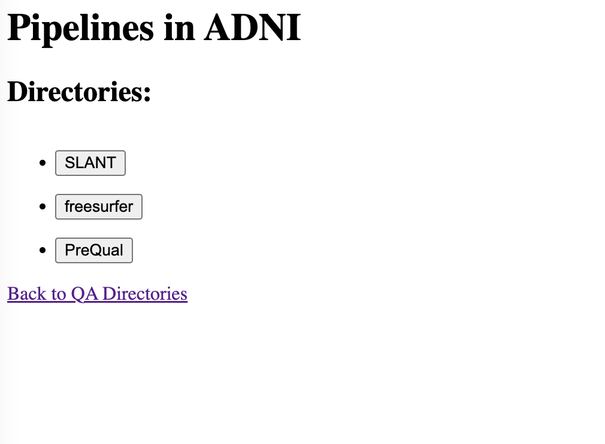
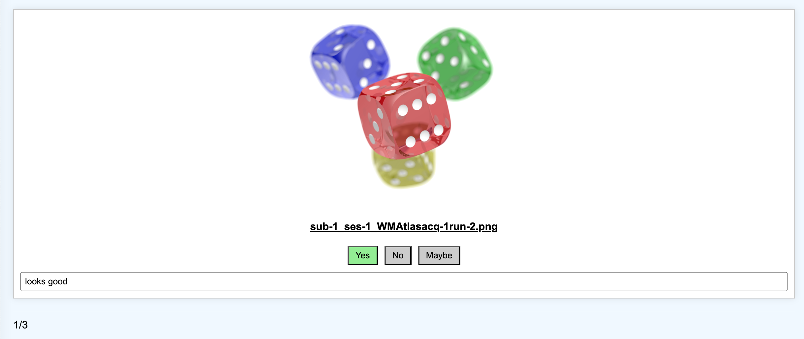

# ADSP_AutoQA
Automated QA for ADSP processing. 
Written by Michael Kim. 
Email: michael.kim@vanderbilt.edu

## NOTE:
The app works best on a smaller monitor, as larger monitors tend to update the screen more slowly.

## Features to add
- Template for QA processes such as PreQual that are PDFs instead of singular PNGs. (Work with Nazirah to determine which pages of the PDFs are best for QA and what the format should be)
    - We determined that everything will be a single PNG instead
- Speed setting: allows you to set the montage speed
- Reverse montage: allows you to montage in reverse order
- Blanket error catch: in case any errors occur in HTML, freezes the entire screen with an error message overlaid

## IN TESTING
Have the base functionality working. Need to test extensively to make sure there are no bugs.

## HOW TO USE

1.) First, install flask, pandas, and tqdm on your current environment (see the requirements.txt file for the versions of these libraries used in testing).

2.) Locate the root path of a QA database directory. The QA database should be structured following the example below:

    /path/to/root
    --> ADNI
    ----> Pipeline1
    ------> sub-XX1_ses-YYY_<PIPELINE>acq-ZZZrun-RR1.png
    ------> sub-XX1_ses-YYY_<PIPELINE>acq-ZZZrun-RR2.png
    ------> sub-XX1_ses-YYY_<PIPELINE>run-RR1.png
    ------> ...
    ----> Pipeline2
    ------> sub-XX1_ses-YYY_<PIPELINE>acq-ZZZrun-RR1.png
    ------> sub-XX1_ses-YYY_<PIPELINE>acq-ZZZrun-RR2.png
    ------> sub-XX1_ses-YYY_<PIPELINE>run-RR1.png
    ------> ...
    ----> ...
    --> BLSA
    ----> Pipeline1
    ------> sub-XX1_<PIPELINE>acq-ZZZ.png
    ------> sub-XX2_<PIPELINE>.png
    ------> ...
    ----> ...
    --> ...

where the structure goes ROOT->DATASET->PIPELINE->QA_FILES and \<PIPELINE\> is the name of the pipeline we are QAing. Note that `sub,ses,acq,run` refer to the BIDS tags for the respective QA file (see above for examples when `ses,acq,run` do not apply). If the QA file refers to a scan that eit All QA files for that particular QA task should live in the same folder. If there is a pipeline, such as tractseg, where it is necessary for QA on a single subject to be split into multiple different png files, then each subtask should have its own \<PIPELINE\> folder.

3.) Run the following command to start the Auto QA server:

    python3 app_montage.py /path/to/root

You should then see a message on the command line that provides a local server address. For example,

     * Running on http://127.0.0.1:5000

Copy that server address (in this example, it would be `http://127.0.0.1:5000`) and paste it into the web browser of your choice (this was tested on google chrome).

4.) You should see a screen that looks like the following:



To select a dataset, simply click on the button that corresponds to the dataset you wish to QA. You should then see a screen that looks like this:



Again, just click on the button that corresponds to the pipeline you wish to QA within the dataset.

5.) At this point, you will be taken to the main Auto QA app. There are a few things that have happened:

- a.) In the `/path/to/root/DATASET/PIPELINE` directory, the app will have searched for a file called `QA.json`. You do not have to worry about creating this file beforehand, as it will be automatically instantiated if it does not exist. It will have a structure that looks like:
```
{
    "sub-1": {
        "ses-1": {
            "acq-1": {
                "run-1": {
                    "QA_status": "yes",
                    "acq": "acq-1",
                    "date": "2024-07-10 00:09:13",
                    "reason": "",
                    "run": "run-1",
                    "ses": "ses-1",
                    "sub": "sub-1",
                    "user": "kimm58"
                },
                "run-2": {
                    "QA_status": "yes",
                    ...
```
Note that it is a nested dictionary, with each leaf dictionary having several tags. The tags are as follows:

- `QA_status`: refers to the quality of the corresponding QA file. `yes` means good, `no` means bad, `maybe` means questionable, or perhaps good depending on the circumstance. 
- `date`: refers to the date/time at which the QA status was last changed for this entry/file.
- `user`: refers to the user who made the last change for this entry/file.
- `reason`: a string that indicates why a scan was attributed the QA status.
- `sub,ses,acq,run`: refer to the BIDS tags that correspond to the scanning session that the QA file is for.

When `QA.json` is automatically instantiated, `QA_status` will be `yes`, `user` will be your username, `date` will be the date/time at which the file was created, and `reason` will be an empty string. A complementary `QA.csv` file will also be created from the JSON. Otherwise, if the file exists already, it will be read in by the app and assessed for valid structure.

- b.) The app will take you to the main Auto QA page. You should see a screen that looks something like this:



where the QA file should be displayed along with three buttons and a text box below the buttons.

6.) At this point, you can begin moving though the images in the QA directory to assess the quality of the preprocessed data. You can move through the QA files one by one using the `left` and `right` arrow keys. You can see how many sessions are left to QA in the bottom left corner of the screen, indicated by the counter for the current scan number you are on compared to the total number of files.

Alternatively (and my preferred method), you can press the `spacebar` to start a montage, where the app will pass through QA files automatically. You can press the `spacebar` again to stop the montage at any point in time, which will pause the montage on the current image.

7.) Once you see a file with a poor or questionable quality, you can indicate so by clicking the corresponding `yes,no,maybe` buttons. The clicked button will light up, showing the current QA status of the file. Additionally, you may enter any relevant text the provides an explanation for your QA decision.

8.) After altering the QA status and/or reason, the app will compare the new status to the status currently held by the file. If there is an update, the change will be pushed to both corresponding `QA.json` and `QA.csv` files upon moving to a different image in the app, along with updated `user` and `date` entries.

9.) You may continue QA for the remaining images, updating as necessary. If you are using the montage function, it will automatically stop once it hits the end of the file list.

---

##### TODO
Once you have performed the QA for several pipelines in a dataset, you can run the `aggregate_QA_status.py` file to produce a single CSV that contains the QA status for each session across all pipelines. **(should be split into one CSV for DTI pipelines and one for structural)**

You can run the script with the following command:

    python3 aggregate_QA_status.py /path/to/root/DATASET/ /path/to/output/csv

where `/path/to/output/csv` is the desired path to the output aggregate file and `/path/to/root/DATASET/` is the path to the QA dataset directory.

**(make it auto output to the dataset directory?)**